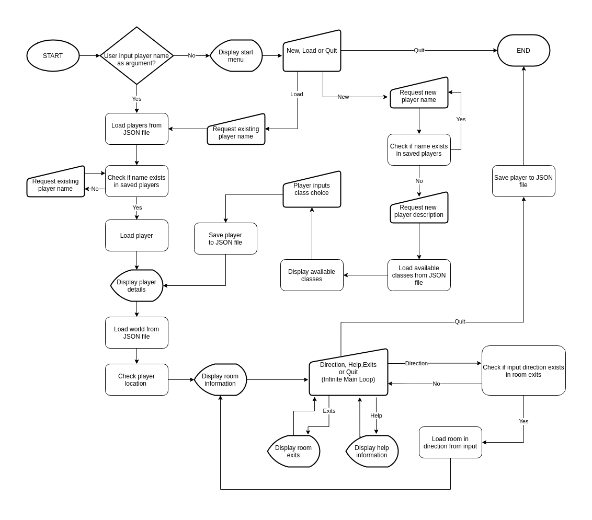
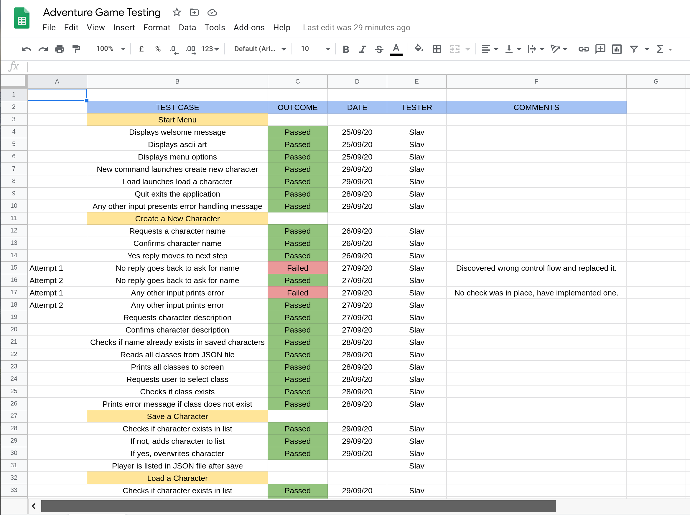

# Adventure Game Terminal App

## GitHub

[https://github.com/SlavBorowski/adventure_game](https://github.com/SlavBorowski/adventure_game)

## Installation and Setup

The application has only been tested to run on Linux machines.

The gems required to run the app are:

- 'inkjet', '~> 0.0.6'
- 'colorize', '~> 0.8.1'

Steps:

1. Install Ruby on your machine if you do not already have it. I recommend using asdf but you can use the version manager of your choice. [https://asdf-vm.com/#/](https://asdf-vm.com/#/)

2. Install git if not already on your machine. [https://git-scm.com/downloads](https://git-scm.com/downloads)

3. Clone the app repository to your machine:
``` 
git clone https://github.com/SlavBorowski/adventure_game.git
```

4. Move to the bin directory within the application
```
cd adventure_game/bin

```
5. Run the setup file to install gem dependencies:
```
./setup
```

5. You can now run the game with:
```
./adventure
```

6. If you already have a saved character, just add the name after the filename to automatically load the character and skip the start menu:
 ```
./adventure name
```

## Software Development Plan

Based on MUDs (Multi User Dungeons) which can be played on the internet, this application will be an engine used to run a game in a similar fashion but for a single player without the need to play over the internet (although multi-user playability may come later). It will come with a very basic world and features which will grow to include NPCs (Non-Player Characters), combat, an inventory system and interaction with items in the world. A fully fleshed out world will take some time to create, the focus for now will be an engine to ensure a full RPG experience.

My application is targeted at two groups. The first group is anyone who would like to play a text based adventure/RPG game. There is still a large audience on the internet for MUD players with hundreds of online worlds available and thousands of players.  The second is anyone who would like to create their own world for their own use or others to play in. Once the engine is completed a user will be able to build their own world, whether a traditional RPG type game or something like a Harry Potter game for children. Allowing customisation of  available classes, the world and any future features which will be implemented. With all the world data stored in JSON files, it wil be easy to edit or replace the existing files.

The user will upon launching the application will be able to create a new character or load an existing one. They will then be put into the world and be able to move around and interact with it using simple command line input, for example: north, south, east, west, open, close, look, attack, inventory, say, etc.


## Features of the game

### Start Menu

The start menu displays an ascii image and shows an introduction to the game. It was implemented a loop which presents the user with 3 options: Load, Save and Quit. The loop continues until the user enters a correct option. User input is passed to a case statement and depending upon the user choice, will either launch the create new character feature, load an existing character or close the application. Any incorrect input will result in the only three correct options being presented.

### Create New Character

The new character creation will take the user through three steps. Firstly, the user is asked to input a name for their character. This is checked against the character names already saved in the JSON file which stores all the existing players, to ensure there are no duplicates created. The next step is to enter a description of the character, the user has complete freedom in what they would like to input here. In both of these steps the user's input is reprinted to the screen and the user can read and confirm they are happy with what they see. The final step is for the user to select a player class. These are read from another JSON file and each is printed to the screen, including the name, a brief description and that attributes for that class. Once the class has been selected, the new character is saved and the game moves to the next step of loading the world.

### Save/Load Character

The save character feature works by loading all the players from the saved players JSON file, checking if the character exists and either adding the player to the list if they do not exist or overwriting the player they are already in the list. The save process also saves the characters current location so when they return to the game, they will start form where they left off. The load character feature is also very simple, it loads the list of players, checks if the name exists and loads the character into an instance of the Player class to be used by the next parts of the application. 

### Move Through World

The final feature creates and allows a player to move through a world of rooms. A list of rooms is loaded from a third JSON file. Each room has:
- An ID number: used to find and load that room if a player moves into it.
- A name: Displayed to the user so they know where they are.
- A description: Describes the location.
- Exits: A hash which stores each cardinal direction as a key and value of either 0 if there is no room in that direction or the ID number of the room which lies in that direction.

When a new player starts they begin in the room with and ID of 1 and they see the name, description and available exits of that room. They enter the move command of 'north', 'south', 'east' or 'west' and if it is one of the available exits, the next room is loaded and displayed. At any time the character also has the options of typing 'help' to see available commands, 'exits' to display the exits for that room or 'quit' to save their character and location, then end the application.

## User Interaction

Interaction with the app has been designed to be simple. In the main menu the user is clearly presented with the options of starting a new game, loading a game or quitting the game. Should a user input an incorrect command they will be presented with the correct available options. During character creation, once again the process has been designed very simply to take command line input. The prompts tell the user what they need to input: a name, a description and a class. The user has complete freedom with name and description. The class must be selected from the presented options. Loading a character is very straightforward as only a name is required.

Once a character is created or loaded and the game begins, the user is presented with the option of typing 'help' at any time to check available commands. At the current state of the application the user can type a direction from the available exits on screen to move in that direction, type 'exits' to see the available exits or type 'quit' to save their character at the current location and end the application.

The installation and setup instructions also show the user how to automatically load their existing character from the command line instead of having to go through the start menu.

## Diagram


## Implementation Plan

The implementation of the application was planned and tracked using the below Trello board:

[https://trello.com/b/S7mExsQc/adventure-game-app](https://trello.com/b/S7mExsQc/adventure-game-app)


The board has four lists: Nice to Have, Backlog, Current and Completed. The Nice to Have list contains any ideas and functions which I would like to implement but most likely won't have time to complete within the project time constraints, so these will be worked on after the submission of the project. The Backlog list contained the 3 main features required to have a functioning application and must be completed by the deadline. As I began working on each item it was moved to the Current list and then to the Completed list once finished.

I commenced the project by working on the start menu to launch the application and present the player with their options. The next step was to work on the character system because the game works around a character interacting with their environment, hence without a character there is no game. Once a character could be created I implemented save and load features for the created character. When I could create, load and save a player, I needed a world which the character could move through. This was done by first creating an individual room, then a group of rooms and finally other functions to interact with those room objects. Once additional item which needed to be implemented after the characters and world was a way to save the character's current location.

## Testing

Here is a link the spreadsheet I used for testing the main features of the application:

[Spreadsheet](https://docs.google.com/spreadsheets/d/1esvwRxVkNWoOt7-0wz5ZR_gOTAm72TgjYmicg-1YpII/edit?usp=sharing)



